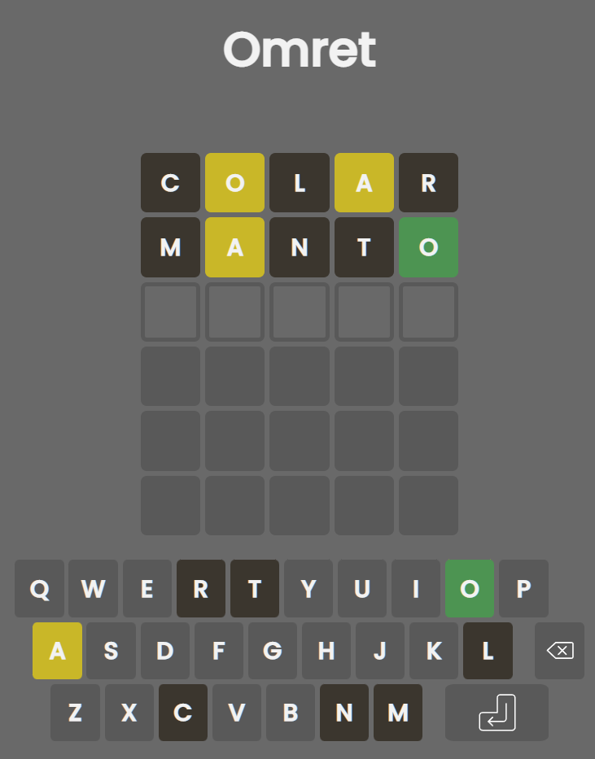

<figure align="center">

<figcaption>Um clone de Wordle, Termo e afins<figcaption>
</figure>

## Sobre

Este é um clone do aclamado jogo Termo, que por sua vez é a versão brasileira do fenômeno mundial Wordle, que consiste em adivinhar uma palavra de cinco letras que é sorteada diariamente com um número limitado de tentativas. O usuário digita uma palavra e o jogo indica através de cores se cada uma das letras está na palavra e na posição certa, na posição incorreta ou não se encontra na palavra.

</img>

Este projeto foi iniciado do zero, utilizando HTML, CSS e Node.js, inicialmente sem nenhum conhecimento do código fonte original e adota uma estrutura de cliente-servidor, motivada pela preocupação com a possibilidade de a palavra certa ser visualizada pelo usuário no código fonte.

O objetivo deste repositório é apenas desenvolver conhecimentos de programação criando um produto concreto.

## Estrutura

### Cliente
- Verifica a palavra digitada pelo usuário através de um dicionário incluído no próprio cliente e caso a palavra seja válida, envia uma requisição ao servidor e realiza as devidas marcações a partir da resposta do servidor. O processo se repete até o usuário acertar a palavra ou o número de tentativas se esgotar.

### Servidor 
- Confere a palavra recebida com a palavra sorteada do dia e envia uma resposta contendo para cada letra a informação sobre a presença da letra, sendo ela correta, na posição errada ou incorreta.
- Programado para sortear uma palavra nova diariamente às 0h e verifica se há necessidade de sortear uma nova palavra quando é iniciado.

O ponto positivo desta estrutura é a segurança, pois a palavra correta armazenada no servidor não é exposta ao usuário durante a execução do jogo, sendo revelada apenas em caso de esgotamento das tentativas.
Um ponto negativo desta estrutura é o número elevado de requisições ao servidor, o que pode se tornar um problema dependendo da quantidade de usuários. Além das requisições padrão (html, css, favicon) é realizada pelo menos mais uma requisição, podendo chegar a quantidade total de tentativas do usuário.

## Tecnologias

## Base de dados
Parte do escopo deste projeto envolveu trabalhar em cima de um _corpus_ de palavras do Português, de modo a gerar um dicionário para a aplicação. A base inicial utilizada foi o [Léxico do Português Brasileiro (LexPorBR)](http://www.lexicodoportugues.com/), porém, por ser uma base linguística e ter sido levantada com relação a frequência de palavras em textos, possui muitos termos em outras línguas, predominantemente Inglês e Espanhol, além de palavras com grafia incorreta e sinais. Sendo assim, foram criados scripts para realizar uma limpeza dessa base de dados e adequação às necessidades da aplicação através da filtragem das palavras contendo apenas cinco letras, exclusão de palavras com bigramas comuns na língua inglesa e remoção de conjugações verbais. Posteriormente foi realizada uma verificação palavra a palavra e, finalmente, foi obtido um dicionário com cerca de 2000 palavras, o que é suficiente para esta aplicação.

## Instalação e Utilização
1. Fazer o download ou clonar o repositório
2. Instalar os módulos do projeto usando <code>npm install</code>
3. Iniciar o servidor executando <code>node server.js</code>
4. Acessar o cliente no endereço <code>http://localhost:4000</code>
